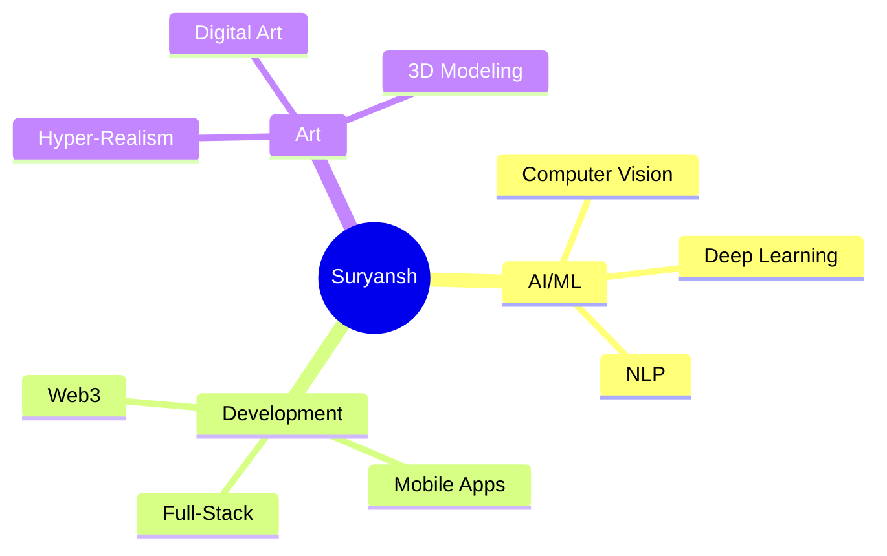

<!-- Your Info. -->
# 🚀 Krishna Kawtikwar | Frontend Developer & Tech Enthusiast

<div align="center">

</div>

<div align="center">

</div>
---

## 🌟 About Me


```yaml
name: Krishna Kawtikwar
location: ["Pune", "India"]
current_focus: "Frontend Development & Full Stack Projects"
website: "krishnakawtikwar.vercel.app"
blog: "coming-soon"
pronouns: ["he", "him"]
fun_fact: "I love building UI that people enjoy using!"

currently_learning: ["Next.js", "TypeScript", "Advanced React Patterns"]
hobbies: ["Coding", "Designing UI", "Tech Blogging"]
``` 

<div align="center">
  
</div>

---

## 🌐 Connect With Me

<div align="center">
## 🌐 Connect With Me

<div align="center">
  
[](https://krishnakawtikwar.vercel.app)
[](https://bonfireblog.vercel.app)
[](mailto:krishna.kawtikwar@gmail.com)
[](https://linkedin.com/in/krishna-kawtikwar)
[](https://instagram.com/mr.x_krishu)
[](https://pinterest.com/your-pinterest-username)

</div>

</div>

<div align="center">
  
</div>

---

## 🛠️ Tech Arsenal

<div align="center">

### 💻 Programming Languages


### 🌐 Web Development


### 🗄️ Databases & Cloud


### 🛠️ Tools & Others


</div>

<div align="center">
  
  
  
  
  
  
</div>

---

## 📊 GitHub Analytics

<div align="center">
   
  
  
</div>

<div align="center">
  
</div>

<div align="center">
  
</div>

---

## 🏆 GitHub Achievements

<div align="center" style="margin-top: 20px;">
        
    </div>

---

## 💡 Random Dev Wisdom

<div align="center">
  
</div>

---

## 🎨 Featured Projects

<div align="center">

[](https://github.com/smirk-dev/Guide-to-levelling-up-on-Github)
[](https://github.com/smirk-dev/Spot-The-Scam-AI)
[](https://github.com/smirk-dev/100DaysOfCode-2025)

</div>

---

## 📈 Contribution Snake

<div align="center">
  <picture>
    <source media="(prefers-color-scheme: dark)" srcset="https://raw.githubusercontent.com/smirk-dev/smirk-dev/output/github-contribution-grid-snake-dark.svg">
    <source media="(prefers-color-scheme: light)" srcset="https://raw.githubusercontent.com/smirk-dev/smirk-dev/output/github-contribution-grid-snake.svg">
    
  </picture>
</div>

---

<div align="center">
  
</div>

## 🎯 Current Focus

<div align="center">



</div>

---

<div align="center">
  
### 🚶‍♂️ Profile Visitors


### 💬 Let's Connect and Build Something Amazing Together!


</div>

---

<div align="center">
  
</div>
